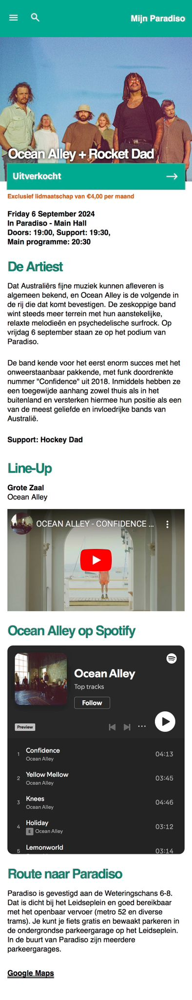
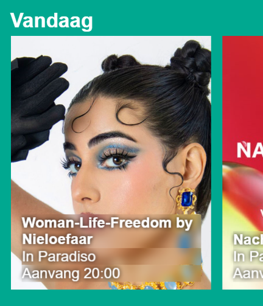

# Procesverslag
Markdown is een simpele manier om HTML te schrijven.  
Markdown cheat cheet: [Hulp bij het schrijven van Markdown](https://github.com/adam-p/markdown-here/wiki/Markdown-Cheatsheet).

Nb. De standaardstructuur en de spartaanse opmaak van de README.md zijn helemaal prima. Het gaat om de inhoud van je procesverslag. Besteedt de tijd voor pracht en praal aan je website.

Nb. Door *open* toe te voegen aan een *details* element kun je deze standaard open zetten. Fijn om dat steeds voor de relevante stuk(ken) te doen.

## Jij

  
uitwerken voor kick-off werkgroep

  ### Auteur:
  Femke Muller

  #### Je startniveau:
  Blauw

  #### Je focus:
  Surface plane
 

## Je website

  
uitwerken voor kick-off werkgroep

  ### Je opdracht:
 https://www.paradiso.nl
 
  #### Screenshot(s) van de eerste pagina (small screen): 
  Paradiso homepagina 
  

  #### Screenshot(s) van de tweede pagina (small screen):
  Paradiso artiest pagina 
  
 

## Toegankelijkheidstest 1/2 (week 1)

  
uitwerken na test in 2e werkgroep

  ### Bevindingen
  Lijst met je bevindingen die in de test naar voren kwamen:
  - Veel afbeeldingen hadden geen naam.
  - Veel linkjes werden opgenoemt als 'banger banger'.
  - Er word vertelt welke kleur de tekst en het logo is.
  - Vertelt dat er een bericht binnen komt.
  - Leest de alinea's niet, alleen de headers.
  - Laat weten wanneer de pagina klaar is met laden.

## Breakdownschets (week 1)

  
uitwerken na afloop 3e werkgroep

  ### de hele pagina: 
  

  ### dynamisch deel (bijv menu): 
  

## Voortgang 1 (week 2)

  
uitwerken voor 1e voortgang

  ### Stand van zaken
  Alle content in de html zetten de basis opzetten van de css ging prima.
  Het was ff inkomen maar tot dit punt was niks nog lastig.

  ### Verslag van meeting
  hier na afloop snel de uitkomsten van de meeting vastleggen

  - Code is netjes
  - Meer spaties gebruiken in code
  - Cool dat dark mode werkt

## Voortgang 2 (week 3)

  
uitwerken voor 2e voortgang

  ### Stand van zaken
Ik heb de image slider laten werken en ik met position de tekst erop gekregen.
Ik heb nog moeite om de 2e pagina te stylen.

  ### Verslag van meeting
  hier na afloop snel de uitkomsten van de meeting vastleggen

  - Uitleg van de image slider gekregen
  - Class gebruiken voor het stijlen van pagina 2

## Toegankelijkheidstest 2/2 (week 4)

  
uitwerken na test in 9e werkgroep

  ### Bevindingen
  Lijst met je bevindingen die in de test naar voren kwamen (geef ook aan wat er verbeterd is):
- Focus state is ng niet gestyled
- Heading staan nog niet op de juiste volgorde
- Nog geen skip link
- Tekst op images hebben nog niet genoeg contrast

## Voortgang 3 (week 4)

  
uitwerken voor 3e voortgang

  ### Stand van zaken
  De layout is grotendeels uitgewerkt van beide pagina's en ik heb youtube en spotify toe kunnen voegen aan de artiestenpagina.
  Ik heb nog problemen met de event list en alle content daarin op de juiste plaats te krijgen.
  Ook staat de header nav nog niet helemaal juist.
  Moet nog animaties toevoegen en javascript schrijven.

  ### Verslag van meeting
  hier na afloop snel de uitkomsten van de meeting vastleggen

  - Event list met flex grow en flex shrink
  - Header nav met flex grow en flex shrink
  - Hover toevoegen bij event list

## Eindgesprek (week 5)

  
uitwerken voor eindgesprek

  ### Je uitkomst - karakteristiek screenshots:
  
  
  

  ### Dit ging goed/Heb ik geleerd: 
  Het bouwen van de website ging me makkelijker af dan ik had verwacht.
   Tijdens dit proces heb ik enorm veel nieuwe dingen geleerd. Zo heb ik onder andere geleerd hoe ik effectief met flex grow en shrink kan werken. Daarnaast heb ik ervaring opgedaan met het implementeren van een dark mode, het maken van een image slider, en het werkend krijgen van een hamburgermenu met JavaScript. Ook heb ik gecompliceerde animaties toegevoegd en veel gewerkt aan de positionering van elementen.

  
  
  

  ### Dit was lastig/Is niet gelukt:
 Het positioneren van de tekst in mijn event list vond ik lastig en ik had veel hulp nodig om het goed te krijgen. Ook heb ik veel tijd besteed aan het JavaScript hamburgermenu, omdat de code van het voorbeeld erg afweek van de code die ik al had. Uiteindelijk is alles wat ik wilde doen gelukt.

  

## Bronnenlijst

  
continu bijhouden terwijl je werkt

  Nb. Wees specifiek ('css-tricks' als bron is bijv. niet specifiek genoeg). 
  Nb. ChatGpT en andere AI horen er ook bij.
  Nb. Vermeld de bronnen ook in je code.

  1. [Hamburger menu icoon](https://icons8.com/icon/8113/menu) 
  2. [Vergrootglas icoon](https://icons8.com/icon/7695/search)
  3. [Kruis icoon](https://icons8.com/icon/6483/multiply) 
  4. [FED 24/25 - JS 3-stap - Oefening 2 - responsive 2-buttons hamburger](https://codepen.io/shooft/pen/VwJXNEg?editors=1100)
  5. [Animista shadow pop animatie](https://animista.net/play/basic/shadow-pop)
  6. [bewegend streepje - Buttons, links en co fancy](https://codepen.io/shooft/pen/BagVYyB)

